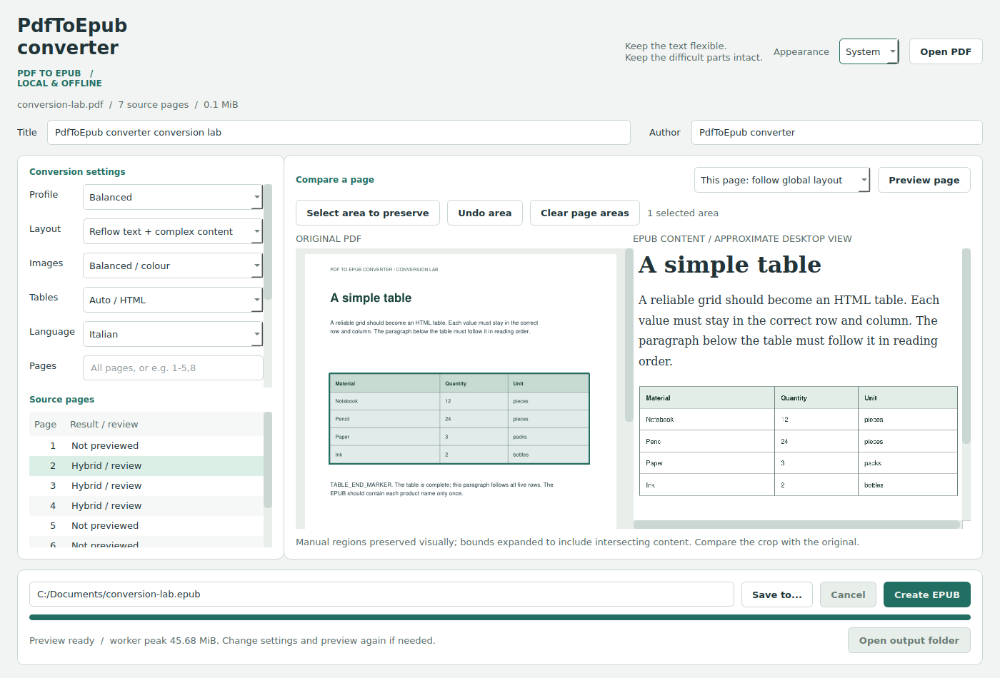

# PdfToEpub converter

A personal, offline desktop tool for converting PDFs into EPUBs for Kindle and other ebook readers. It keeps ordinary text adjustable and preserves difficult tables, formulas and illustrations visually where needed.

**Version:** 0.2.0 · **Desktop:** Windows, macOS and Linux · **Conversion:** local, with no account, API key or conversion service.



## What it does

| Content or feature | Result |
| --- | --- |
| Paragraphs and headings | Reflowable text with adjustable font size |
| Reliable simple ruled tables | HTML tables with preserved rows and columns |
| Complex tables, formulas and diagrams | Image crops that preserve their appearance |
| Slides, scans and difficult pages | Whole-page images when needed; OCR is not included |
| PDF bookmarks | Nested EPUB contents and source-page navigation |
| Existing internal and website links | Clickable EPUB links; links on image content appear alongside it |
| Manual corrections | Preserve a selected region or an entire problem page |
| Everyday use | Comparison preview, saved profiles, remembered folders, cancellation and System / Light / Dark themes |

## Start on Windows: portable app

This is the simplest option and **does not require installing Python**.

1. Open the repository's [Actions page](https://github.com/FabioFlo/pdftoepub/actions).
2. Choose a **successful** run of **Verify and build PdfToEpub converter**.
3. Download **PdfToEpubConverter-0.2.0-Windows-portable** from the run's **Artifacts** section. GitHub may require you to sign in. Artifacts are retained for 30 days.
4. Extract the entire ZIP into a normal folder, for example `Documents\PdfToEpubConverter`.
5. Open **`PdfToEpubConverter.exe`**. Keep the executable and its accompanying files together; do not launch it from inside the ZIP.

GitHub's **Code → Download ZIP** contains the source, not the portable executable. Use the source instructions below for that download. If an artifact has expired, a new successful workflow run can generate another one.

## Your first conversion

1. Click **Open PDF** and select a local PDF. To try the included sample, open `examples/conversion-lab.pdf`.
2. Start with the **Balanced** profile:
   - **Layout:** Reflow text + complex content.
   - **Images:** Balanced / colour.
   - **Tables:** Auto / HTML.
3. Set the title, author and document language if needed. Leave **Pages** empty to convert the full PDF, or enter a selection such as `1-5,8`.
4. Select a source page and click **Preview page**. Compare the original and reconstructed text, tables and formulas. Try page 2 of the sample for an editable table.
5. Choose a destination using **Save to...**, then click **Create EPUB**.
6. Use **Open output folder** to find the result. Review flagged pages and test the EPUB in your intended reader.

**Keep the reflow layout enabled for normal reading.** **Preserve pages as images** keeps complete page appearance, but text cannot resize independently and the EPUB can become much larger. It is useful for slides or difficult pages.

Changing settings does not update an existing preview or export automatically: preview or create the EPUB again.

## Reading on Kindle

Send the `.epub` through [Send to Kindle](https://www.amazon.com/sendtokindle). The web uploader accepts files up to **200 MB**; other delivery methods can have different limits. Inspect the delivered book on the device, especially wide tables, mathematical notation and navigation.

The desktop comparison is an approximate EPUB preview, not a Kindle emulator. Image content may need zooming, while reflowable text can use the reader's font-size controls. EPUB support and link behavior vary between readers.

## Settings and manual corrections

| Setting | How to use it |
| --- | --- |
| Balanced profile | Recommended starting point: reflow text, balanced colour images and automatic tables |
| Technical profile | Reflow text with balanced images; preserve detected tables as images |
| Compact profile | Reflow text with lower-resolution grayscale images and automatic tables |
| Sharp / colour | Higher-resolution crops; typically larger output files |
| Remove repeated margins | Omit repeated margin text, page counters and shared margin images from reflow pages |
| Borderless tables | Experimental detection; aligned prose can be mistaken for a table, so review results |
| Preserve PDF and web links | Restore actual PDF links; printed references without a link are not inferred |
| This page: preserve appearance | Keep one problem page as an image without changing the layout of the whole book |
| Appearance | System follows desktop appearance; Light and Dark override it. Document colours remain unchanged |

To preserve just a difficult region:

1. Select its page and click **Select area to preserve**.
2. Drag a rectangle over the table, formula or diagram in the original PDF.
3. Click **Preview page** and inspect the green outline and converted content.
4. Use **Undo area** or **Clear page areas** to revise the selection.

Selections expand to include intersecting lines, tables and figures whole; overlapping selections merge. A connected layout can expand the crop considerably, so inspect it before exporting.

**Save profile...** stores your conversion preferences. Settings and last folders are remembered locally. Titles, authors, page selections, per-page overrides and selected regions are specific to the open document and reset when another PDF is opened. The renamed app uses a new settings namespace, so preferences from earlier-name builds must be selected again once.

## Output files

A desktop export creates these files beside the chosen destination:

| File | Purpose |
| --- | --- |
| `book.epub` | The file to send to your reader |
| `book.report.json` | Conversion settings, page decisions, review messages, file size, timing and measured worker memory |
| `book.preview/` | Local XHTML, CSS and images used by the comparison preview |

The EPUB contains its own resources. Keep the preview folder while reviewing the book; you can remove it afterward. Cancelling or failing a conversion keeps a previously completed EPUB intact. During conversion, temporary disk space is needed; retaining a preview duplicates image resources on disk.

## Install from source

Download and extract the [repository source](https://github.com/FabioFlo/pdftoepub), or clone it with Git. Run the following instructions from the extracted repository folder.

### Windows

1. Install **Python 3.12 or 3.13**, enabling the Python launcher or adding Python to PATH.
2. Run **`setup-windows.bat`** once. It creates a local `.venv` and downloads dependencies.
3. Run **`start-windows.bat`** to open the app.

To create your own portable Windows folder, run **`build-windows.bat`** after setup. It builds and checks `dist\PdfToEpubConverter\PdfToEpubConverter.exe`. Keep that entire folder together. Windows packaging must run on Windows.

Italian first-start instructions: [START_HERE_IT.md](START_HERE_IT.md).

### macOS and Linux

Python 3.10+ is supported by the source configuration; Python 3.12 is used in CI.

```bash
python3 -m venv .venv
.venv/bin/python -m pip install -e ".[gui]"
.venv/bin/python -m pdftoepub gui
```

After installation, `start.sh` also launches the app. Linux may require the distribution's Qt XCB/XKB desktop libraries. Installation needs internet access; conversion and preview run offline.

## Command line

The command-line engine can be installed without the desktop dependencies:

```bash
python -m pip install -e .
python -m pdftoepub convert input.pdf output.epub --language it --preview
python -m pdftoepub convert input.pdf output.epub --profile compact
python -m pdftoepub convert input.pdf output.epub --pages 1-12 --preserve-pages 4,8-9
python -m pdftoepub convert input.pdf output.epub --tables image --quality balanced
python -m pdftoepub convert input.pdf output.epub --regions areas.json --no-links
python -m pdftoepub check output.epub
python -m pdftoepub convert --help
```

Use `--overwrite` to replace an existing output and Ctrl+C to cancel. CLI conversion retains a preview folder only with `--preview`. Explicit layout, quality and table flags override the selected profile.

A region file maps source page numbers to normalized rectangles, for example:

```json
{"2": [[0.15, 0.29, 0.7, 0.45]]}
```

The four coordinates are `x0, y0, x1, y1` as fractions of the displayed page bounds, from 0 to 1.

## Limitations and troubleshooting

PDF structure and reading order are inferred. Review flags help identify uncertain pages but cannot detect every error. More than two columns, nested tables and unusually positioned content need particular care.

| Issue | What to check |
| --- | --- |
| EPUB is unexpectedly large | Check that the global layout is reflow, not full-page images. Try Balanced or Compact image quality, and inspect page overrides |
| A table or equation is incomplete | Compare the source; preserve that region or override the page's layout |
| Scanned text cannot be selected | Scans are image-based; OCR is not available |
| A cross-page link is missing from a preview | One-page previews exclude other-page destinations; export all relevant pages to restore the link |
| A PDF will not open because it is encrypted | Provide an unlocked local copy |
| An older preview folder cannot be replaced | Choose a fresh output filename; previews from earlier-name builds use different markers |

Conversion processes one page at a time in a separate worker, caps rendered images, reuses identical assets and stages EPUB resources on disk. This keeps memory manageable for tested documents, but does not impose a hard RAM limit on arbitrary PDF decoding. Details and measured workloads are in [docs/BENCHMARKS.md](docs/BENCHMARKS.md).

## Development and verification

```bash
python -m pip install -e ".[gui,demo]"
python -m unittest discover -s tests -v
python tools/benchmark.py --stress-repeat 50
python tools/benchmark.py --unique-image-pages 12 60
```

GitHub Actions runs tests on Windows, macOS and Linux, then builds the portable Windows app and checks its packaged conversion worker. GUI tests use Qt's offscreen platform; interactive device testing remains separate. The local `check` command validates package structure and resource links. Full EPUB conformance can be checked with [EPUBCheck](https://github.com/w3c/epubcheck).

- [Changes](CHANGELOG.md)
- [Sample conversion expectations](examples/EXPECTED_RESULTS.md)
- [Sample navigation expectations](examples/NAVIGATION_EXPECTED.md)
- [Verification and memory benchmarks](docs/BENCHMARKS.md)

The source is licensed under **GNU AGPL v3 or later**. See [LICENSE](LICENSE) and [THIRD_PARTY_NOTICES.md](THIRD_PARTY_NOTICES.md) for dependencies and notices.
